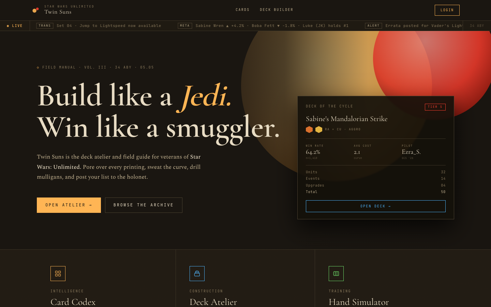

# Twin Suns — Star Wars Unlimited Deck Builder



A personal web application for playing **Star Wars: Unlimited** in the Twin Suns format. Browse every card ever printed, build decks, track your collection, and drill mulligans with the hand simulator. Built on a live card database that auto-updates from the official SWU API every Monday.

Not affiliated with Fantasy Flight Games, Asmodee, or Lucasfilm.

---

## What it does

### Card Browser
- **2,360+ cards** across all released sets, updated automatically each Monday
- Full-text search with debounced real-time filtering
- Filter by aspect, type, keyword, cost, set, and trait — all combinable
- Smart grouping by name + subtitle + type merges art variants into single entries
- "My Collection" toggle — one click to view only cards you own
- Double-click any card to add it to your collection instantly

### Card Detail
- High-resolution card art with back-side flip for double-sided cards
- Aspect pips, stat blocks, card text, keywords, and set info
- Add to collection with `+`/`−` count controls; remove with a single click
- Wishlist toggle for cards you're hunting

### Deck Builder
- **Twin Suns format**: two leaders, one base, ten cards
- Three-stage flow: pick leaders → pick base → build your deck
- Tabbed card browser (Units / Events / Upgrades) grouped by cost within each tab
- **Suggested tab** — synergy-scored card recommendations based on your leaders' keywords and traits
- Aspect compatibility filtering — only legal cards shown for your leader pair
- "My cards only" toggle to build from your collection
- Full CRUD: create, edit, save, delete

### Deck Management
- `/decks` — dedicated deck list with leader image strips, aspect pips, and sort by date or name
- `/decks/[id]` — full deck view with leader and base art, card grid, and deck stats
- Inline delete with confirmation step

### Collection & Profile
- Collection tab on your profile with per-card count badges
- Wishlist tracking with add/remove from the card detail dialog
- Collection completion percentage shown in your profile header

### Hand Simulator
- Draws a random 6-card opening hand from any saved deck
- Mulligan mode with editable opponent leader field for note-taking

### Rules Engine (`/playtest`)
- A from-scratch **Twin Suns rules engine** that actually plays the game — deploy leaders, play units/events/upgrades, attack, resolve abilities, win
- Two engines coexist: **v1** (`src/lib/game-engine/`, powers the older `/game` UI) and **v2** (`src/lib/engine-v2/`, the active rewrite) — see [Rules engine](#rules-engine-engine-v2) below
- Load a real saved deck or a fixture deck, play Human-vs-AI / AI-vs-AI / Human-vs-Human in the browser at `/playtest`

---

## Design

Twin Suns uses the **Imperial Field Manual** design system — a custom set of CSS custom properties built around a dark amber-and-parchment palette with three typefaces:

- **Cormorant Garamond** — display headers
- **Spectral** — body text
- **JetBrains Mono** — data, labels, eyebrows

No component libraries. All UI is hand-rolled with `var(--ts-*)` tokens, with zero Tailwind in production components. The splash page features a twin suns radial gradient background, scanline overlay, left vignette, and a live "Deck of the Cycle" spotlight panel.

---

## Stack

| Layer | Tech |
|---|---|
| Frontend | Next.js 15 (App Router), TypeScript |
| Backend | FastAPI, SQLAlchemy, Pydantic v1 |
| Databases | SQLite — `swu_cards.db` (cards) + `swu_app.db` (users/decks) |
| Auth | JWT (bcrypt, configurable expiry) |
| Deployment | Docker → Docker Hub → TrueNAS/Portainer |
| Card data | Official SWU API, rebuilt weekly via GitHub Actions |

**Key architecture pattern:** Next.js API routes (`src/app/api/**/route.ts`) are thin server-side proxies. The browser never calls the FastAPI backend directly — all requests go through Next.js first, which forwards them with the auth token. Two API URL env vars exist for this reason: `NEXT_PUBLIC_API_URL` (browser → Next.js) and `INTERNAL_API_URL` (Next.js server → FastAPI).

---

## Rules engine (engine-v2)

`frontend/src/lib/engine-v2/` is a pure-functional Twin Suns rules engine — no React imports, deterministic, fully unit-testable. It's the active rewrite of the v1 engine (`src/lib/game-engine/`, still powering the legacy `/game` route). Design rationale and the full AST spec live in [ENGINE_DESIGN.md](ENGINE_DESIGN.md); current state and history are in [PROGRESS.md](PROGRESS.md) / [CHANGELOG.md](CHANGELOG.md).

**The core idea: cards are data, not code.** Each card's rules text compiles to a small declarative **AST** of ~30 effect primitives (damage, heal, draw, give, create_token, capture, move, search, return_to_hand, return_from_discard, take_control, attack, use_force, if_did, choose_one, …) walked by one interpreter. New cards are JSON, not TypeScript — the path to "zero code per set."

```
Card rules text
  └─ engine-v2-data/match.ts   — Tier-1 deterministic template matcher (text → AST)
       └─ spec/validate.ts     — gate: AST checked against the closed primitive vocab
            └─ engine-v2/      — the engine proper:
                 ├─ spec/ast.ts        — the card-spec AST (effects, selectors, predicates, modifiers, abilities)
                 ├─ runtime/interpret.ts — the ~one interpreter that walks Effect ASTs
                 ├─ runtime/{attack,damage,cost,modifiers,triggers,selectors,predicates,…}.ts
                 ├─ runtime/state_based.ts — state-based actions (defeats, win check) to fixpoint
                 ├─ runtime/async_step.ts  — replay-based pause/resume for browser player input
                 └─ reducer.ts  — step(state, action) → next state (the public entry point)
```

**Two engines, don't mix them.** v1 (`game-engine/`) is frozen-but-live; v2 (`engine-v2/`) is the target. v2 has a clean boundary (no React), drives a headless CLI (`npm run play-cli`) and the browser UAT route `/playtest`. Real card data flows in via `engine-v2-data/translate.ts` (DB card → v2 spec) + the matcher.

**Verification (there are no meaningful backend tests — the engine is where the test discipline lives):**

```bash
cd frontend
npm run scenarios            # engine unit scenarios (115+), the primary correctness net
npm run translate-scenarios  # matcher + real-card translation scenarios
npm run validate-scenarios   # spec-validator scenarios (every fixture validates clean)
npm run play-cli -- --ai both  # full AI-vs-AI game to completion (integration smoke)
npm run fuzz                 # property test: 200 seeded-random games, no throws/hangs, all terminate
npx tsc --noEmit             # type safety = the secondary correctness check
```

**Correctness oracle:** the official SWU Comprehensive Rules (public PDF). Rules are verified against the source, never authored from memory — see the standing note in [CLAUDE.md](CLAUDE.md).

---

## Running locally

```bash
# Start both frontend + backend (sets DB_DIR automatically)
./dev.sh
```

**Prerequisites:** Node.js 20+, Python 3.10+, pip.

The script activates the Python venv, sets `DB_DIR=./databases/`, and starts uvicorn on `:8000` and Next.js on `:3000` (proxied to `:4000`). On first run you'll need to build the card database:

```bash
DB_DIR=$(pwd)/databases python backend/scripts/build_database.py
```

Dev URLs:
- Frontend: http://localhost:4000
- Backend API: http://localhost:8000
- Swagger docs: http://localhost:8000/docs

---

## Production deployment

```bash
./deploy.sh
```

Builds both Docker images, pushes them to Docker Hub, and triggers a Portainer stack redeploy via API. No manual steps. Requires `.env.prod` with `JWT_SECRET`, `PORTAINER_URL`, `PORTAINER_USER`, `PORTAINER_PASSWORD`, and `PORTAINER_ENDPOINT_ID`.

The production stack (`docker-compose.prod.yaml`) mounts SQLite databases from a TrueNAS path. `DB_DIR` is the single source of truth for database location — set in the compose file for production, in `dev.sh` for local dev.

---

## Security notes

- Rate limiting: 120 req/min globally, 10/min on auth endpoints
- JWT secret lives in Bitwarden, not committed to the repo
- Backend port 8000 is internal-only in production (not host-bound)
- No unauthenticated debug or admin endpoints

---

## Disclaimer

Star Wars: Unlimited card images and game content are property of Fantasy Flight Games / Asmodee. This project uses the official card API for personal, non-commercial use. Card data auto-syncs weekly but may lag behind new releases.
